<a href="https://react.dev/learn"></a>
<a href="https://reactnative.dev/docs/getting-started"></a>
<a href="https://redux.js.org/"></a>
<a href="https://tailwindcss.com/"></a>
<a href="https://expo.dev/"></a>

# Qwicker, Dependable Delivery Solutions
Qwicker is a mobile application built with React Native dedicated to facilitating efficient item delivery services, akin to popular platforms like Lalamove. This project hosts a comprehensive suite of features, including authentication, role-based access control, user and shipper registration, an admin dashboard, shipper profile viewing, item posting, auction and shipper selection, rating and feedback systems, order management and notification, online payment integration with VNPay, and system administration functionalities. With a focus on user convenience and effective management, Qwicker serves as a valuable resource for developers looking to explore and contribute to the advancement of delivery service applications.


For a comprehensive demo, you can watch the full video on YouTube by clicking on the link provided [here](https://www.youtube.com/watch?v=GISC5GFzDdM).
## Table of contents
* 🎥[Overview](#overview)
* ✨[Features](#features)
* 📂[Folder structure](#folder-structure)
* 🏛️[Base dependencies](#base-dependencies)
* 🛠️[Prerequisites](#prerequisites)
* 🚀[Getting Started](#getting-started)
* 🔗[References](#references)
* 📧[Contact](#contact)
## 🎥Overview
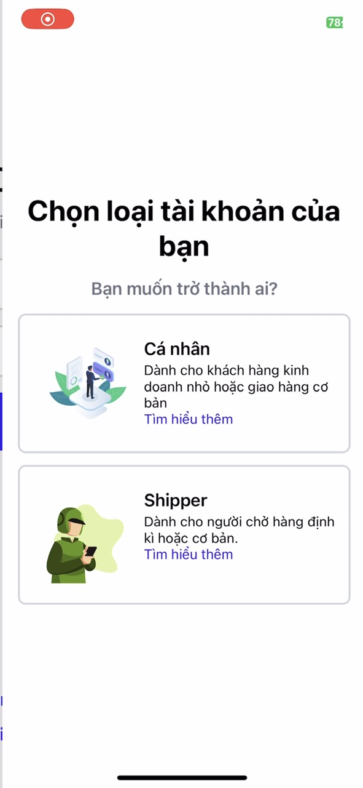</img>
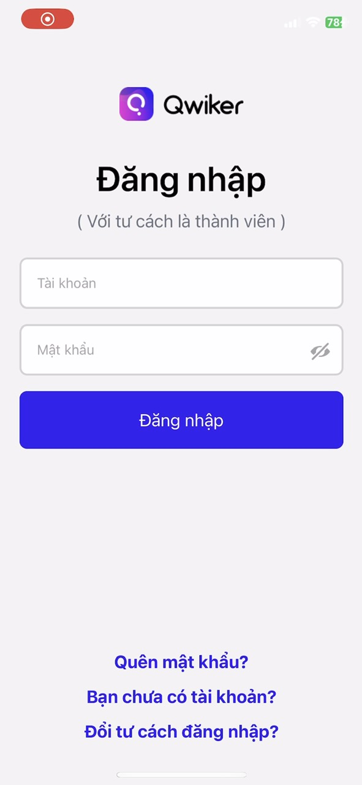</img>
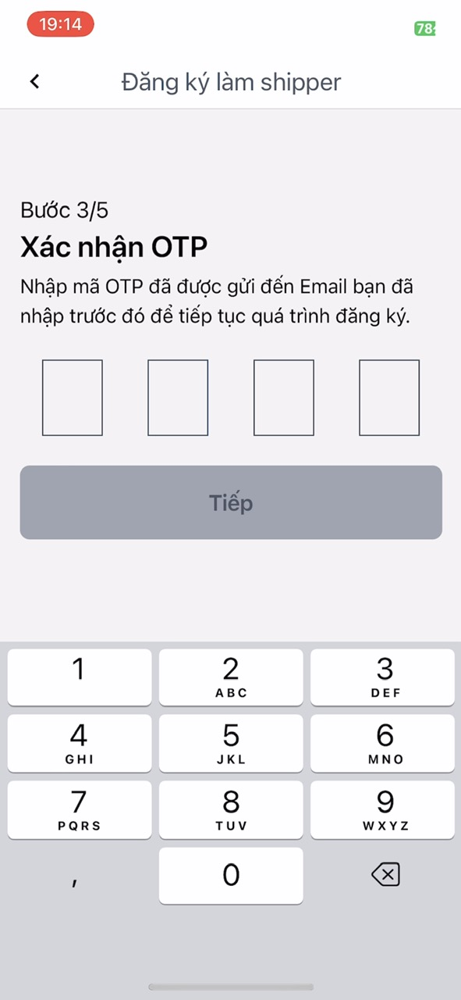</img>
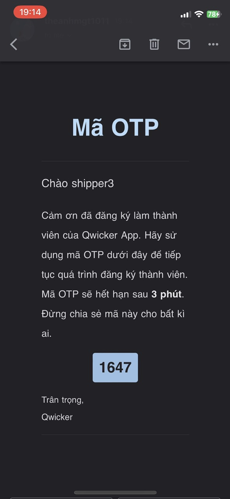</img>
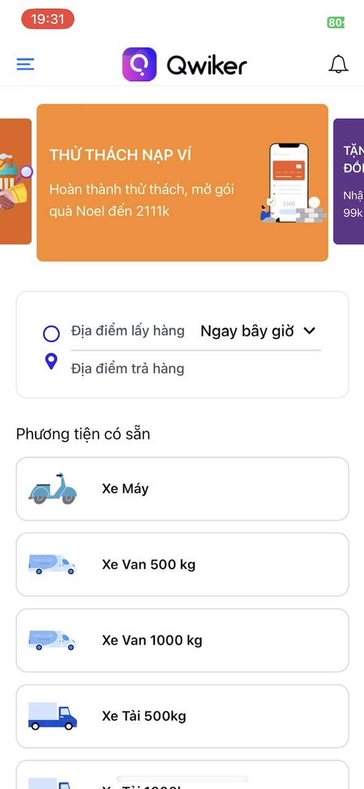</img>
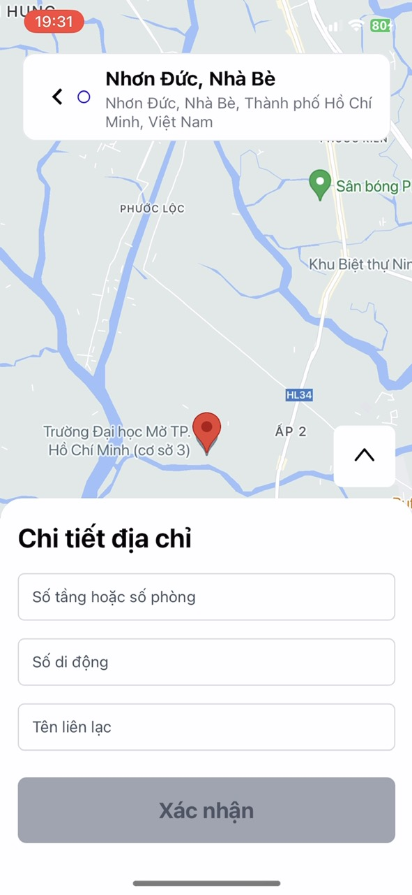</img>
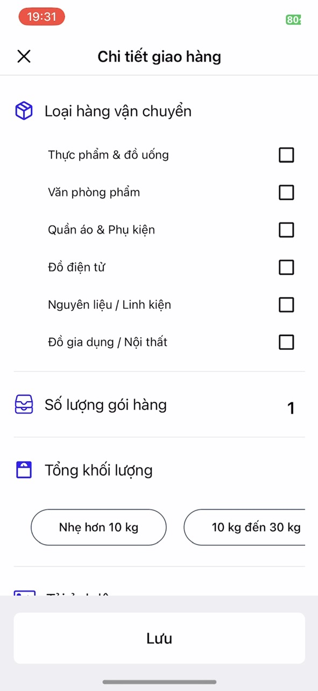</img>
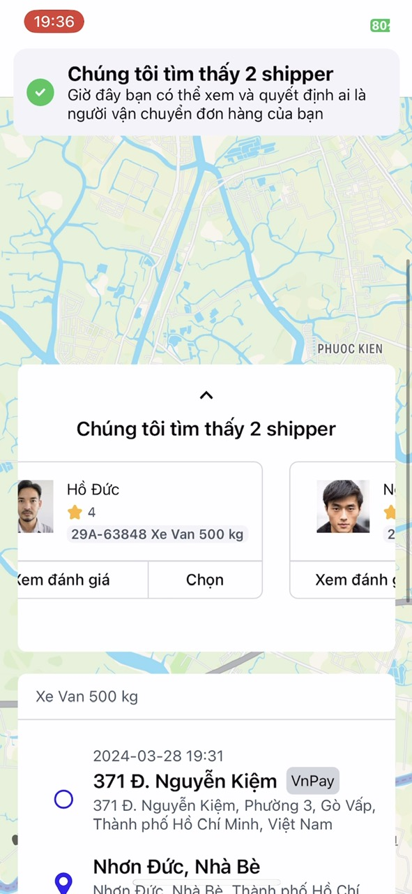</img>
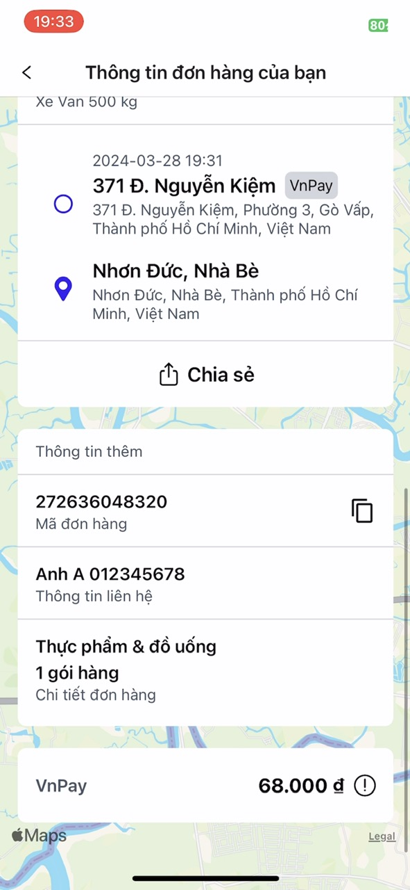</img>
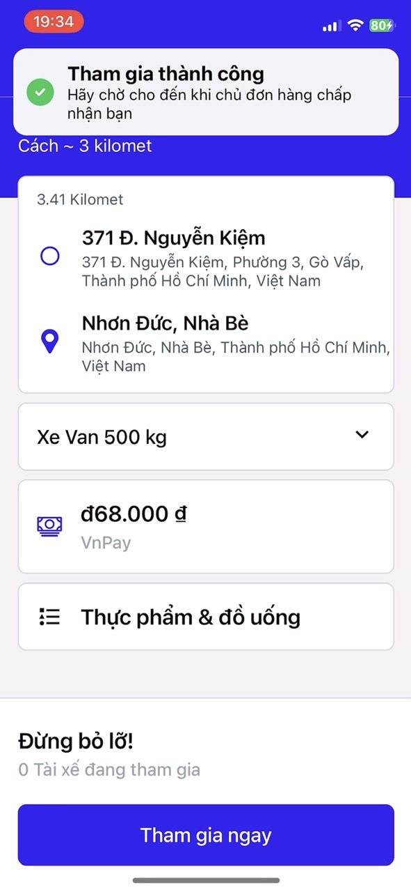</img>
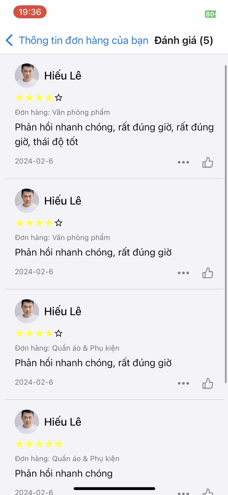</img>
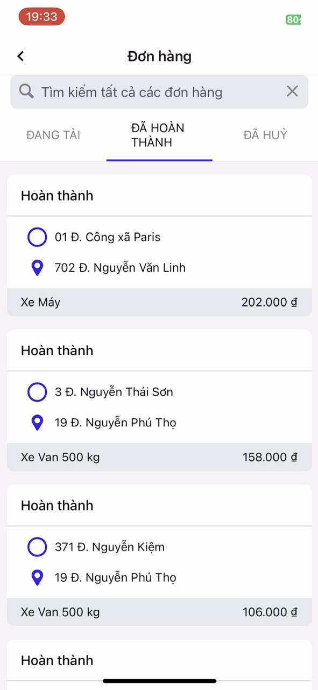</img>

## ✨Features
User Management:
- Feature: Authentication and Role-based Access Control
- Description: Users can register and log in with roles such as admin, shipper, and regular user. Each role has specific permissions within the app.

User and Shipper Registration:
- Feature: Account Registration
- Description: Users and shippers can register accounts. Shippers are required to provide additional information such as avatar and identification details. Shipper accounts need approval from the admin.

Admin Management:
- Feature: Admin Dashboard
- Description: Admins can manage users and shippers, including adding, deleting, and updating shipper information. Admins can also manage promotional services and view lists of pending shipping orders without assigned shippers.

Shipper Information Viewing:
- Feature: Shipper Profile
- Description: Users can view shipper profiles and details, including community ratings and feedback from previous deliveries.

Item Posting:
- Feature: Posting Delivery Requests
- Description: Users can post items they want to ship, providing details such as pickup and delivery locations, package dimensions, and any special requirements.

Auction and Shipper Selection:
- Feature: Bidding System
- Description: Shippers bid on posted delivery requests. The owner of the post chooses a shipper through an auction process. Only the post owner sees the auction details. The system automatically notifies the chosen shipper and notifies other bidders of rejection.

Rating and Commenting:
- Feature: Rating and Feedback System
- Description: Users can rate and leave feedback on shippers based on their delivery experiences.

Order Recording and Notification:
- Feature: Order Management and Notification
- Description: Shippers can record completed shipping orders within the app. This action triggers email notifications to customers to inform them that their orders have been completed.

Online Payment with VNPay:
- Feature: Online Payment Integration
- Description: Users can make online payments for delivery services through VNPay, providing a convenient and secure payment method.

System Administration:
- Feature: Admin Order Management
- Description: Admins can view detailed order information, including order status, date, and product details. They can also perform various search operations by date, product, and generate charts for delivery frequency and revenue analysis.

## 📂Folder structure
This project adheres to a straightforward structure:
- `src`: This directory serves as the primary container for all application code.
    - `assets`: This folder stores all images, vectors, etc.
components: Here, you'll find common components used throughout the app.
    - `configs`: This folder houses network logic, such as `API.js`.
    - `constants`: Contains various constants used in the project.
    - `data`: Includes initial data functions that enable the app to run without a server.
    - `features`: Holds utils.js, a file containing various methods for handling common logic.
    - `hooks`: Stores custom hooks that mimic React hooks.
    - `navigation`: Manages the navigational components.
    - `redux`: Contains all reducers, slices, and actions, exposing the combined result via store.js.
    - `screens`: Houses all application screens/features.
        - `Screen`: Each screen is stored within its own folder, accompanied by separate files for its code and any sub-screens or sub-features.
            - `Screen`.js
            - `SubScreen`.js
App.js: The main component that initiates the entire app.

## 🏛️Base dependencies
- [axios](https://github.com/axios/axios) for networking.
- [react-native-maps](https://github.com/react-native-maps/react-native-maps) providing a map as google map, apple map...
- [react-navigation](https://reactnavigation.org/) navigation library.
- [react-native-async-storage](https://www.npmjs.com/package/@react-native-async-storage/async-storage) as storage solution.
- [redux](https://redux.js.org/) for state management.
- [redux-persist](https://github.com/rt2zz/redux-persist) as persistance layer.
- [redux-thunk](https://github.com/gaearon/redux-thunk) to dispatch asynchronous actions.
- [nativewind](https://www.nativewind.dev/) similar to tailwind CSS for styling the components

## 🛠️Prerequisites
Before running this project, ensure you have the following installed:
- [Node.js >= 20](https://nodejs.org/en) and npm
- IDE (Recommended: use [Visual studio code](https://code.visualstudio.com/download))
- [Android studio, Android SDK](https://developer.android.com/studio), [JDK > 11](https://www.oracle.com/java/technologies/javase-jdk11-downloads.html) or [Expo application](https://apps.apple.com/us/app/expo-go/id982107779) (choose one)

## 🚀Getting Started
After installing Expo on your mobile phone or Android studio run the following commands to start experiencing this project:
```shell
git clone https://github.com/Theanhmgt/qwicker-reactnative-frontend.git

cd qwicker-reactnative-frontend/

npm install -i

npm start
```
During this stage, you'll be presented with a menu where you can choose from different options to utilize this project. These options include 'Press a' to open on Android, 'Press w' to open on the web, etc. or you can scan the QR code to launch the project in the [Expo](https://apps.apple.com/vn/app/expo-go/id982107779?l=vihttps://apps.apple.com/vn/app/expo-go/id982107779?l=vi) mobile app.

## 🔗References
Here are some helpful resources and references for further information:
- [React Native Documentation](https://reactnative.dev/docs/getting-started)
- [Redux Documentation](https://redux.js.org/introduction/getting-started)
- [Expo Documentation](https://docs.expo.dev/)

## 📧Contact
Don't hesitate to contact me if you have any confusion or questions
<a href="https://anhthenguyen.work@gmail.com" target="blank"></a><a href="https://www.facebook.com/theanhnguyenmgt" target="blank"></a>

<a href="#qwicker-reliable-delivery-services" style="transition: all .25s ease-in-out; position: fixed; bottom: 0; right: 0; display: inline-flex; cursor: pointer; align-items: center; justify-content: center; margin: 0 2em 2em 0; padding: .25em; width: 8em; height: 2em;">
  🔼 Back to top
</a>